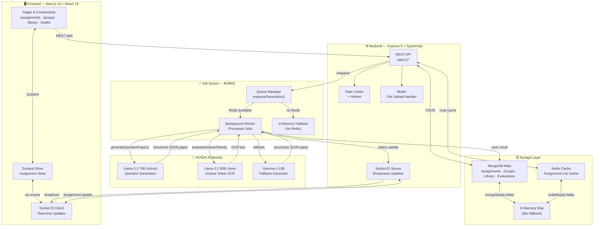
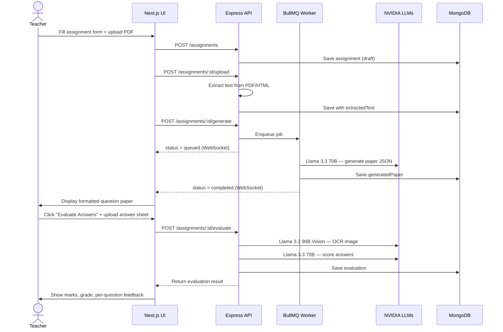

<div align="center">

# 🧠 Veda AI

### AI-Powered Educational Assessment Platform

Generate structured exam papers from source documents, evaluate student answer sheets with vision AI, and manage your school's assessment workflow — all in one place.

[](https://www.typescriptlang.org/)
[](https://nextjs.org/)
[](https://expressjs.com/)
[](https://www.mongodb.com/)
[](https://redis.io/)
[](https://socket.io/)

</div>

---

## Architecture



---

## Features

### 📄 Question Paper Generation
- Upload source material (PDF, HTML, TXT) — all questions are extracted strictly from that document
- Configure question types, counts, marks per section (MCQ, Short, Long, Numerical, etc.)
- AI auto-formats MCQ options (`A) … B) … C) … D) …`), distributes difficulty levels (Easy / Moderate / Challenging), and produces a structured answer key
- Regenerate at any time; paper and answer key persist to MongoDB

### 📝 AI Answer Sheet Evaluator *(new)*
- Upload a student's answer sheet — handwritten image (PNG/JPG), typed PDF, or plain text
- Vision model (`Llama 3.2 90B Vision`) performs OCR on handwritten sheets
- Evaluation model scores each answer against the answer key with partial marks
- Per-question feedback, total marks, percentage, and letter grade (A+ → F) stored to MongoDB
- Expandable result cards in the UI per student

### 🏫 Groups & Library
- Organise assignments by class, subject, and board
- Library stores reference documents (papers, quizzes, lesson plans, guides, rubrics)

### ⚡ Real-time Updates
- `assignment:update` WebSocket events keep the UI in sync across tabs
- Status progression: `draft → queued → generating → completed`

---

## Tech Stack

| Layer | Technology |
|---|---|
| Frontend | Next.js 16, React 19, TypeScript, Tailwind CSS 4, Zustand |
| Backend | Express 5, TypeScript, Socket.IO, Zod validation |
| AI Models | NVIDIA API — Llama 3.3 70B, Llama 3.2 90B Vision, Gemma 4 31B |
| Database | MongoDB Atlas (Mongoose 9) |
| Queue | BullMQ + Redis (ioredis) |
| File Handling | Multer, pdf-parse |
| Security | Helmet, CORS, express-rate-limit |

---

## Project Structure

```
veda-ai/
├── backend/
│   └── src/
│       ├── server.ts        # Express app, routes, Socket.IO
│       ├── generator.ts     # Question paper generation (NVIDIA LLMs)
│       ├── evaluator.ts     # Answer sheet evaluation (vision + text models)
│       ├── queue.ts         # BullMQ job queue + in-memory fallback
│       ├── repository.ts    # MongoDB models + CRUD (assignments, groups, library, evaluations)
│       ├── cache.ts         # Redis caching layer
│       ├── toolkit.ts       # Streaming LLM toolkit endpoint
│       ├── types.ts         # Shared TypeScript types
│       ├── validation.ts    # Zod schemas
│       └── config.ts        # Environment config
├── frontend/
│   └── src/
│       ├── app/
│       │   └── (shell)/
│       │       ├── assignments/  # Assignments page
│       │       ├── groups/       # Groups page
│       │       ├── library/      # Library page
│       │       └── toolkit/      # AI toolkit page
│       ├── components/
│       │   ├── assignment/
│       │   │   ├── assignment-form.tsx      # Create assignment form
│       │   │   ├── assignment-list.tsx      # Sidebar list
│       │   │   ├── assignment-output.tsx    # Paper display + PDF export
│       │   │   └── evaluate-panel.tsx       # Answer sheet evaluator UI
│       │   └── layout/                      # Sidebar, topbar, mobile nav
│       ├── lib/
│       │   ├── api.ts        # All fetch calls
│       │   ├── types.ts      # Frontend TypeScript types
│       │   ├── socket.ts     # Socket.IO client
│       │   └── constants.ts  # Default question types
│       └── store/
│           └── use-assignment-store.ts  # Zustand global state
└── README.md
```

---

## API Reference

### Assignments
| Method | Route | Description |
|---|---|---|
| `GET` | `/api/v1/assignments` | List all (paginated) |
| `POST` | `/api/v1/assignments` | Create assignment |
| `GET` | `/api/v1/assignments/:id` | Get assignment |
| `DELETE` | `/api/v1/assignments/:id` | Delete assignment |
| `POST` | `/api/v1/assignments/:id/upload` | Upload source document |
| `POST` | `/api/v1/assignments/:id/generate` | Enqueue generation |
| `POST` | `/api/v1/assignments/:id/regenerate` | Re-generate paper |

### Evaluations
| Method | Route | Description |
|---|---|---|
| `POST` | `/api/v1/assignments/:id/evaluate` | Submit answer sheet |
| `GET` | `/api/v1/assignments/:id/evaluations` | List evaluations |
| `DELETE` | `/api/v1/evaluations/:id` | Delete evaluation |

### Other
| Method | Route | Description |
|---|---|---|
| `GET` | `/api/v1/stats` | App statistics |
| `GET` | `/api/v1/groups` | List groups |
| `POST` | `/api/v1/groups` | Create group |
| `GET` | `/api/v1/library` | List library docs |
| `POST` | `/api/v1/toolkit/generate` | Stream LLM response |
| `GET` | `/health` | Health check |

---

## Getting Started

### Prerequisites

- Node.js 18+
- MongoDB Atlas URI (or local mongod)
- Redis URL (or use the built-in in-memory fallback)
- NVIDIA API key from [build.nvidia.com](https://build.nvidia.com)

### 1. Backend

```bash
cd backend
cp .env.example .env
# Fill in NVIDIA_API_KEY, MONGODB_URI, REDIS_URL
npm install
npm run dev
```

Backend runs at `http://localhost:4000`

### 2. Frontend

```bash
cd frontend
cp .env.example .env.local
# Set NEXT_PUBLIC_API_URL=http://localhost:4000
npm install
npm run dev
```

Frontend runs at `http://localhost:3000`

---

## Environment Variables

### Backend (`backend/.env`)

```env
PORT=4000
FRONTEND_URL=http://localhost:3000
NVIDIA_API_KEY=nvapi-...
MONGODB_URI=mongodb+srv://...
REDIS_URL=redis://...
REDIS_HOST=...
REDIS_PORT=...
REDIS_USERNAME=default
REDIS_PASSWORD=...
```

### Frontend (`frontend/.env.local`)

```env
NEXT_PUBLIC_API_URL=http://localhost:4000
NEXT_PUBLIC_SOCKET_URL=http://localhost:4000
```

> **Note:** Both Redis and MongoDB are optional. Without them the app runs entirely in memory — useful for local development, but data is lost on server restart.

---

## Data Flow



---

<div align="center">

Built with ❤️ for educators · Powered by NVIDIA AI

</div>
